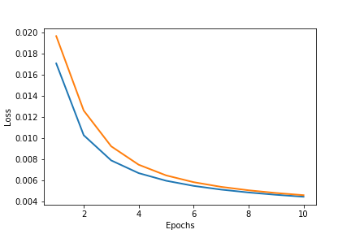
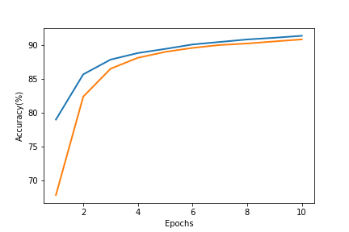

# MNIST
# BME 595 Report - Homework 04

## Overview of the code

The code was written for homework 4 of [ME 595 Deep Learning course](https://e-lab.github.io/html/teaching.html) offered at Purdue University. MNIST dataset is classified into numbers using the neural networks written from scratch and from PyTorch package. In both neural networks, the input images are flattened into an array with length 28 x 28, and is mapped into the first layer with 128 neurons, and then into the second layer (output) with 10 neurons. The nonlinear activation function used here is sigmoid function. Loss is evaluated using the MSE (mean squared error) method with learning rate of 0.001 for my code and 0.01 for PyTorch package. The weights are updated using SGD method.

In the training process, MNIST dataset is passed into the neural networks with 10 epochs. Both neural networks take a batch of four image data at one time. The runtime MSE loss is calculated as a function of time as shown in Fig. 1. Here, the losses for both neural networks converge as the number of epochs increases.

##  Training results

   
```
Fig.1 Runtime loss as a function of epochs produced from my own code (blue) and from the PyTorch package (red). My code shows a smaller loss than the PyTorch package.
```

```
Fig.2 Accuracy on the test dataset calculated from my own code (blue) and from PyTorch package (red)
```
 From Fig. 1, the runtime loss of the neural network written from scratch (0.004 at 10 epochs) is smaller than that of the PyTorch package (0.016 at 10 epochs). This is probably because my network does not include the regularization loss. The neural network written from scratch spends 24.1 s to process one epoch of data, which is similar with that required for PyTorch package (22.4 s/epoch).


